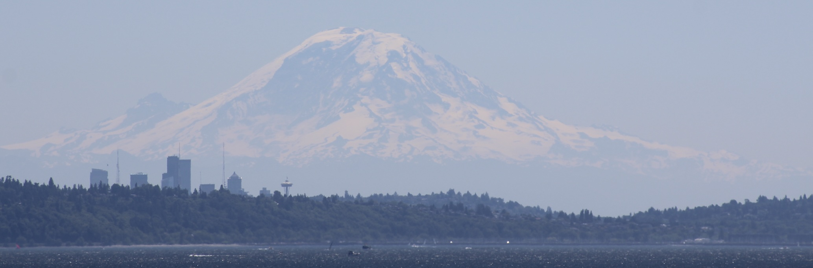

::: {.left-align}

I am a quantitative researcher and PhD student at UC Santa Barbara’s Bren School of Environmental Science & Management, interested in understanding how human activities affect wildlife. My research combines quantitative methods and policy analysis to inform conservation and support effective wildlife management.

:::

{width=100%}

::: {.left-align}
I graduated from UC Berkeley in 2022 with a double major in Environmental Economics & Policy and Conservation & Resource Studies along with a minor in Data Science. I worked with the Middleton Lab on my senior honors thesis - using GPS collar data to study guanacos interactions with roadways in Patagonia. 

Since graduating from Berkeley, I worked for 2 years as an Research Analyst at The Brattle Group, a litigation consulting firm. Before starting my PhD I worked full-time as an Senior Research Analyst at ECO Northwest on the Data Analytics team in the Seattle office.
:::

::: {#page-listing}

